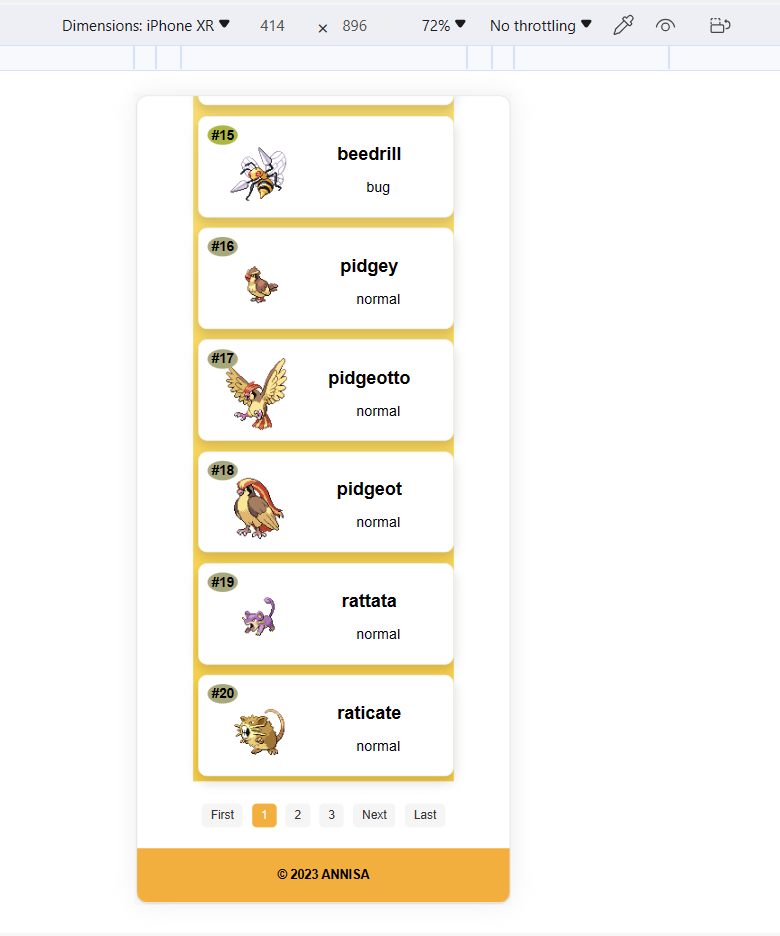

<h2>DASHBOARD</h2>

ini adalah tampilan dashboard yang saya buat

Kemudian apabila kursor diarahkan pada card maka elemennya akan memberi efek membesar

Pada bagian header terdapat logo pokemon dan juga github

Kemudian terdapat fitur search, dimana dapat mencari pokemon berdasarkan nama

 
 

Pada gambar ini terdapat prev, next dan last, yang fungsinya untuk mempermudah melihat id ke paling akhir dan kembali ke pokemon dengan id paling awal

 
 

Gambar ini menunjukan bahwa terdapat hingga 1000 lebih data yang saya gunakan dan ambil dari API untuk membuat website ini

 
 

 Apabila kita mencari di search nama pokemonnya, makan akan muncul seperti ini

 
 
<h2>DETAIL</h2>

Apabila di klik maka akan menampilkan detail seperti ini

Akan menampilkan data dalam bentuk tabel, dan juga menampilkan statistik pokemon dalam bentuk radar chart

Kemudian pada gambar pokemon di sebelah kiri menampilkan animasi berputar dari depan ke belakang

 
 
<h2>RESPONSIVE</h2>

Disini saya mencoba untuk menampilkan tampilan yang responsive, contohnya pada tampilan Iphone XR

 
 

Kemudian pada tampilan Ipad Mini

